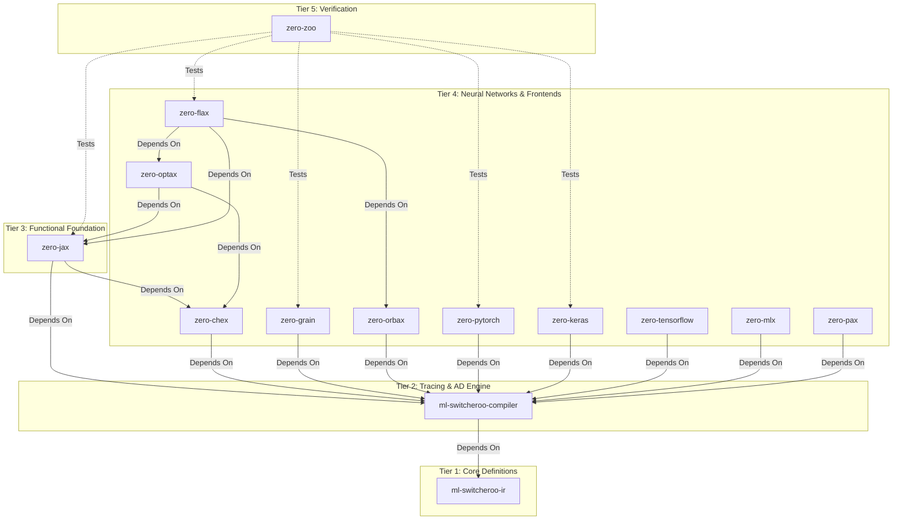
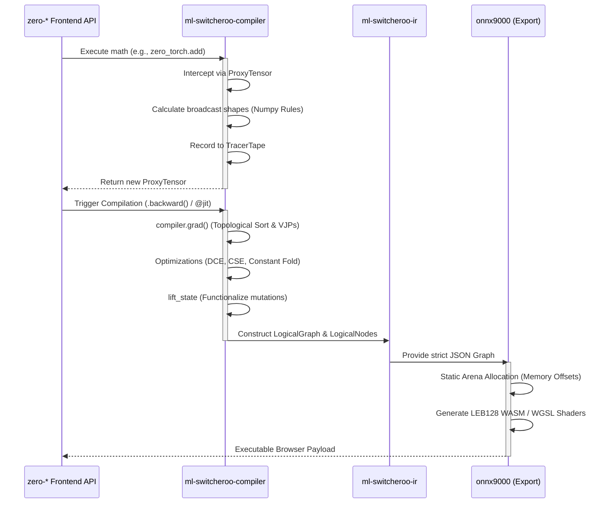

**Current Repository Context:** You are viewing the unified architecture documentation from within the `zero-optax` repository.

# Abstract ML Machine Ecosystem Architecture

*Note: This architecture document is shared across all repositories in the `zero-*` and `ml-switcheroo-*` ecosystem to provide comprehensive technical context on how the frameworks interoperate.*

## The N-to-M Translation Problem

The Abstract ML Compiler ecosystem is designed to solve the $N \times M$ translation problem in Machine Learning. Instead of writing bespoke translators for every framework (JAX, PyTorch, Keras) to every target (WASM, WebGPU, TensorRT), we trace $N$ frontends into a strictly defined Intermediate Representation (IR), which is then consumed by $M$ backends.

This achieves a source-to-source and source-to-browser compilation pipeline utilizing **strictly zero external dependencies** (relying solely on the Python Standard Library and `numpy` for eager evaluations).

## Ecosystem Repository Taxonomy

The ecosystem is strictly hierarchical. Circular dependencies are forbidden. The repositories are organized into tiers:

### 1. `ml-switcheroo-ir` (Tier 1)
The universal, canonical dialect. Defines `LogicalNode` and `LogicalGraph`. Contains the schema validator enforcing ONNX spec compliance without requiring the heavy `onnx` pip package.

### 2. `ml-switcheroo-compiler` (Tier 2)
The computational heart. Implements:
* **TracerTape**: Uses `threading.local` for concurrent, thread-safe AOT tracing.
* **ProxyTensors**: Overloads Python math dunders to capture eager operations.
* **AD Engine (`compiler.grad`)**: Reverse-mode automatic differentiation, topological sorting, gradient accumulation, and exact mathematical VJPs.
* **Optimizations**: Static Shape Inference (matching Numpy broadcast logic), Dead Code Elimination (DCE), and Common Subexpression Elimination (CSE).

### 3. Frontends (`zero-*`) (Tiers 3 & 4)
* **`zero-jax`**: Mimics the JAX API (`jnp`, `lax`, `jit`, `grad`, `vmap`). Uses Pytree flattening to route state safely into the compiler tape.
* **`zero-chex`**: Typing and shape assertions (deeply integrated with `zero-optax` and `zero-jax`).
* **`zero-grain`**: Deterministic data loading and transformations.
* **`zero-orbax`**: Checkpoint loading (`.msgpack`/`tensorstore`) for PyTrees.
* **`zero-optax`**: Provides standard optimization schedules and gradient transformations matching Google's `optax`.
* **`zero-flax`**: Builds upon `zero-jax` to provide Neural Network layers (`Dense`, `Conv`, `Attention`) and `nnx` state functionalization.
* **`zero-pytorch`, `zero-keras`, `zero-tensorflow`, `zero-mlx`**: Mimic eager, object-oriented, and stateful semantics. They dynamically lift mutable states (like `nn.Parameter` or `tf.Variable`) into purely functional graph inputs/outputs via the compiler's internal `lift_state` pass.

### 4. `zero-zoo` (Tier 5)
The proving grounds. Contains identical architectural definitions (MLP, CNN, Micro-Transformer/NanoGPT) written across all frontends. Headless CI pipelines train these deterministically for 10 steps to assert `.allclose()` float-for-float equivalence ("Golden Seed" testing) across all simulated frameworks and final backend compilations.

---

## Compilation Pipeline & Data Flow

When a user executes code in any `zero-*` frontend, the framework delegates the logic to the backend pipeline, mapping high-level API calls down to executable WASM/WebGPU binary code.

### Trace-to-AST Linking
To provide clear error messages and allow for framework-specific syntactic rewrites, the compiler dynamically links trace operations to the original Python syntax trees. Leveraging `inspect.currentframe()`, every `LogicalNode` emitted into the IR captures a `source_ast_ref` binding it back to the exact file path, line number, and AST ID in the user's source code.
